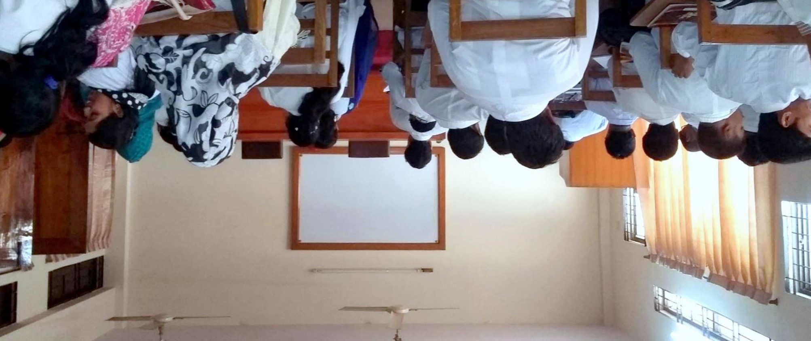

As a complete newcomer to JavaScript, I have to be honest and say that when I first looked at the schedule for my ICS 314 class, I was scared. I was expected to complete the entirety of a basic introduction to JavaScript on a website called freecodecamp.com, and then complete two times practice exercises in the two following days. If the warning from Professor Johnson hadn’t already been enough, this was my wake-up call that was telling me that this semester would require me to be on-point with managing my time and making sure that all of my homework was done on time. I have to say, I quite enjoy being able to view the schedule weeks in advance via the Morea Framework used by the ICS department at the University of Hawaii at Manoa, but at the same time, it’s a very scary thing—if one doesn’t pay attention to the schedule, one can very easily become overwhelmed in the blink of an eye.

Nevertheless, in this first week of ICS 314, I have done my best to look ahead in order to complete my assignments on time. Luckily for me, JavaScript as a language is quite similar to Java, and so my previous knowledge with that language was indispensable when learning JavaScript. Although I was slightly thrown off at first by the lack of data types and the usage of var, let, and const in JavaScript, I quickly became used to notation, and my current opinion of JavaScript is that it is quite a useful language. Using .jsons to store data seems to be a very intuitive process, and, to my knowledge, JavaScript is one of the basic languages that almost every programmer knows, so I intend to further my knowledge in this regard. 

Athletic software engineering is, at first, glance, a very effective method for memorizing new concepts. I agree with the idea that consistent practice will more easily lead to memorization rather than cramming, but at the same time, this very method does create stress. When one has to balance work from every class along with work, it becomes harder to find the time to put in this consistent practice. However, working under stress, especially in the format of the WODs, will without a doubt make it much easier for me to solve problems under pressure and under the constraints of an ever-approaching deadline. 

I also quite enjoy the flipped classroom teaching style, as it means that I can listen to lectures and move forward with content at my own pace, but my only gripe is that it puts a lot of burden on the student, as the amount of homework becomes much larger: the student now has to watch lectures and exercises on his/her own time. In exchange for this, however, class time becomes extremely productive. Students gain hands-on time in the presence of their instructor, which is invaluable in a problem-solving environment like that of ICS. For this reason, I can say that I quite enjoy the flipped classroom style of teaching.
