For this project, I was required to make my own theme or topic, take photographs in accordance with that topic, and also keep a journal while taking these photos. Before the final project, I also learned about basic photography and things like how a camera works and how the current technology was developed. 

For this project, I took many photos over the course of an entire semester, and then culled the photos I had until I had the ones that I would use for the project. I also attached the journal to the files. For the actual project, I printed out the photos and turned in a sort of portfolio, however, I no longer have the portfolio, but I do have the raw images and text that I used, which is displayed here.

As someone who is much more used to STEM work and logical and mathematical thinking, this project helped me to develop my creative brain, which I feel was a valuable experience.

<strong>Photography Project</strong>

I would like to first start off my journal by pointing out that it was definitely not as easy to take the photos that I did as I thought it would be. For one thing, my goal was to take pictures of Japanese people in their free time, and so in order to depict them doing whatever it is that they would be doing in their free time, the photos would need to be candid photos. I also didn’t really want to include faces of people who didn’t want their faces in my pictures, even though I’m not actually publishing this anywhere. These two problems made it much more difficult to take photos than I had originally anticipated, and to be completely honest I feel like it would’ve been much easier to take photos of something like scenery, or at least something that didn’t include candid photos of people. But I digress. 

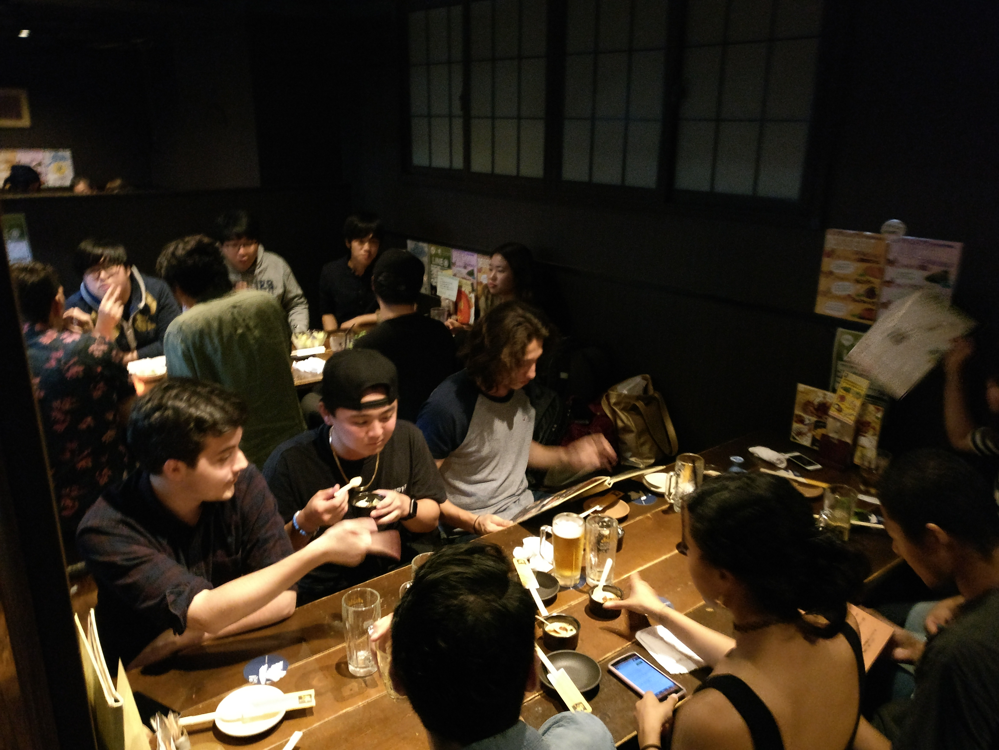

1日10月
A nomikai gathering organized by Japanese students to which many foreign students from countries including America, Korea, and China were invited. Drinking together is extremely common among Japanese people, as it is the preferred method of networking in Japan. This is represented very well here: even though the foreign exchange students had just arrived and weren’t very close to the Japanese students, they were invited to drink together with them. In fact, it may be that because they weren’t very close, they were invited to drink together as a way to get to know each other.

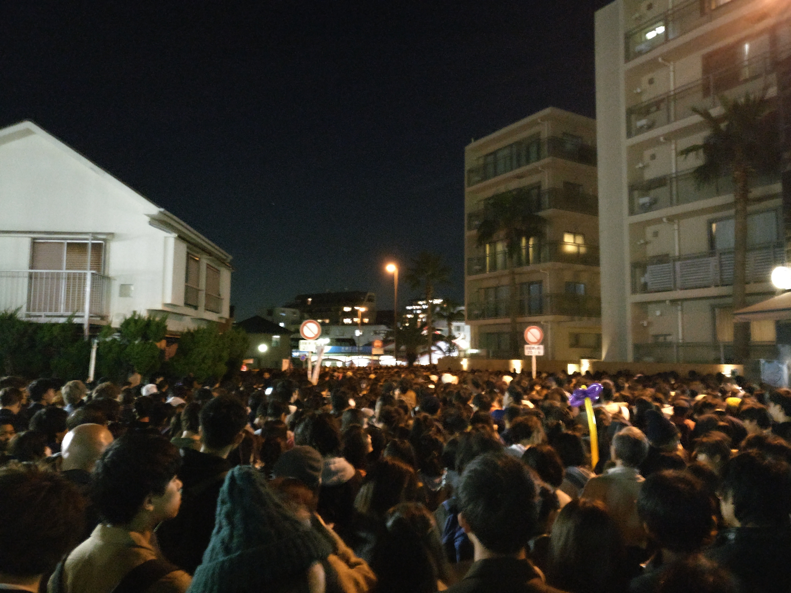
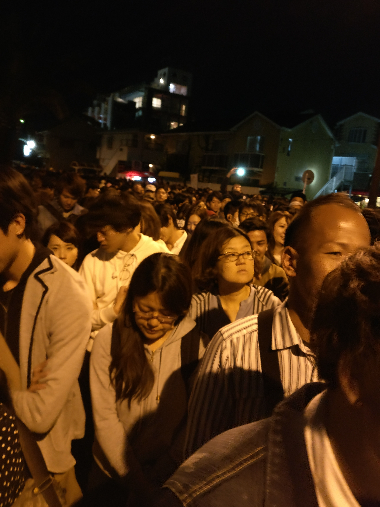

16日10月、2
These photos depict the massive amount of people waiting in line to leave Katase-Enoshima Station after a hanabi taikai (fireworks festival) near the station. Although the taikai had finished at 7PM, an hour before this photo was taken, there were still many, many people waiting to get to the station. On top of being a very late hanabi taikai (most are held during the summer), this taikai was also held near the last station of a pretty obscure train line, yet the amount of people who showed up was amazing; a testament to how popular fireworks really are in Japan.

17日10月
A picture of the monument in the middle of Machida Station. Standing near the monument are people standing and waiting for their friends. In Japanese, this is called machiawase, and I thought that the similarity between machiawase and Machida Station was interesting, especially considering that I myself use the same location to meet my friends as well. Japanese people don’t drive very much, instead preferring to take trains and/or buses, so these kinds of situation are very common—so much so that there are even special rooms in some stations (called 待合室 machiaishitsu) created just for that purpose!

20日10月
A Japanese shopping mall. Just like any shopping mall in America, this mall has an abundance of stores and restaurants for its customers to enjoy. When I first started this project, I kind of intended to find things that were unique to Japanese people, but I quickly started to realize that I wouldn’t be able to find many differences between how Japanese people and American people spent their free time if I didn’t think hard enough.

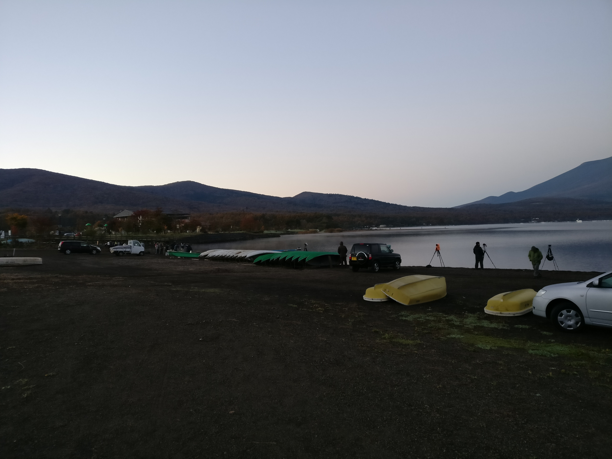

7日11月
A photo taken at the Yamanakako camp even held through Obirin University. This photo was taken at 6AM, and it depicts other photographers who have already set up and are waiting to take pictures of Mt. Fuji as the sun rises, which is only slightly depicted on the right side. 

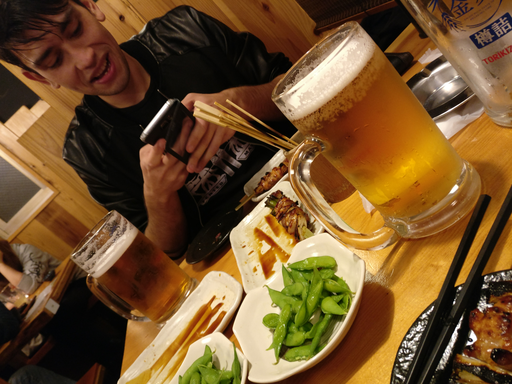
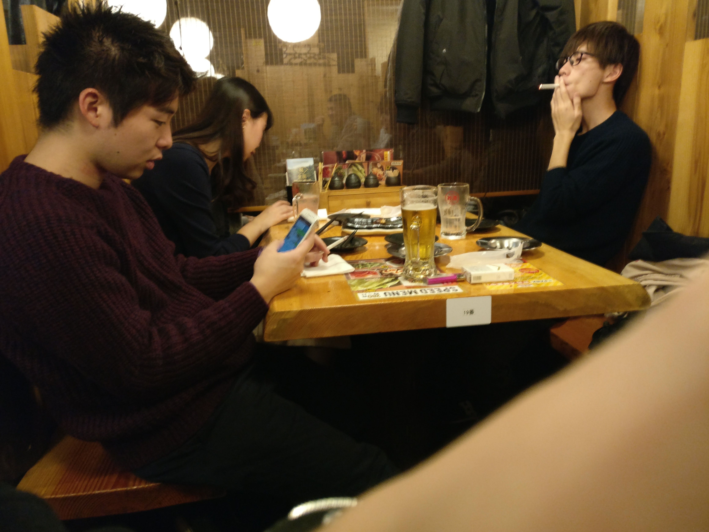

17日11月、2
Enjoying beer, yakitori, and smoking in true Japanese fashion. Alcohol, as I mentioned before, is quite an important part of Japanese society, but following closely behind alcohol is tobacco. Nearly 20% of the entire Japanese population smokes cigarettes, and it shows: many restaurants have smoking and non-smoking seats, and many izakaya are okay with its customers smoking anywhere in the facility. Although smoking may not be considered something people do in their free time, it is definitely an important part of Japanese society.

27日12月
A picture of my host brother, Oto-kun, holding a snowball at a rest stop on the way to visit his grandparents in Yamagata. Other Japanese children and their parents can also be seen in the background. Just like American children, many Japanese children enjoy playing in the snow. Still not many differences to see here besides the fact that Japanese people think that using a carrot for a snowman’s nose is strange.

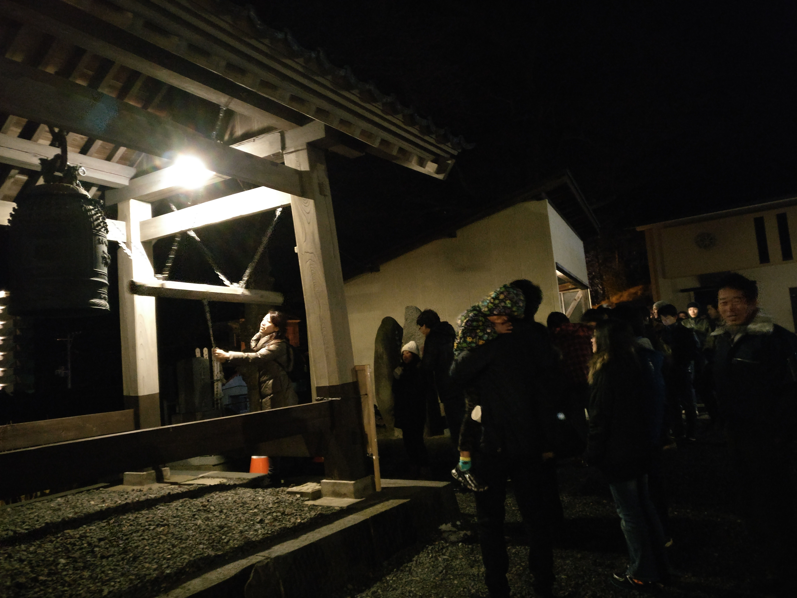
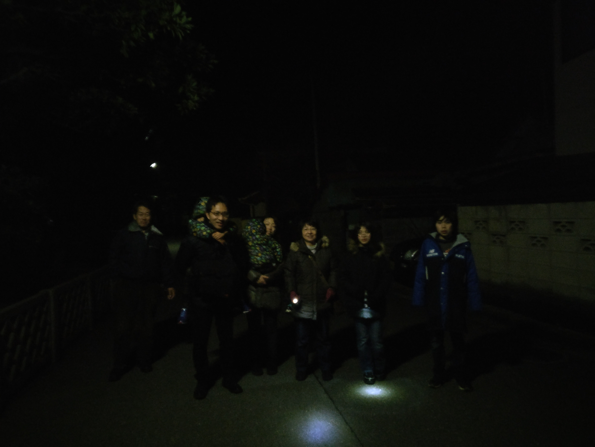

31日12月、1日1月
A picture of people going to hatsumoude at the turn of the new year. The first picture shows my host mom ringing a bell at a temple, and the second picture depicts my host family walking home in the dark after having visiting both a shrine and a temple. In Japan, many people watch the kouhaku,  a show similar to the American New York ball drop, eat soba, and then go to their first temple/shrine visits of the year after the conclusion of the kouhaku show. 

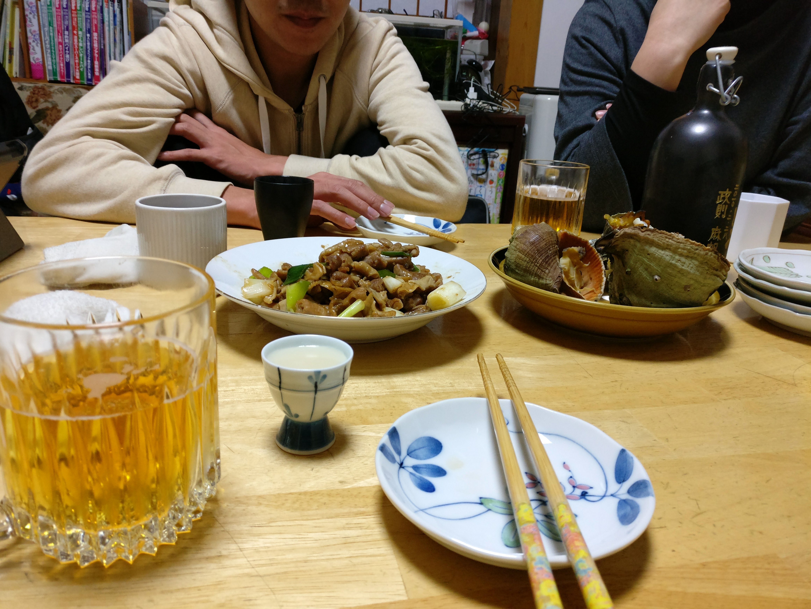

4日1月
Beer, Japanese sake, and otsumami on a kotatsu. For the New Year, many, if not all Japanese people go back to their jikka, or grandparents’ house. Since most people move to Tokyo for work, this is often quite a journey. It’s customary to eat and drink together with each side of your family for at least one night for the new year. For some people, this may be the only time they see their parents or grandparents during the year. The shellfish depicted is something that is only available in Yamagata, and is also a shellfish that my host family has caught themselves before. In addition to this, my host grandfather even goes to gather his own water from a nearby river!

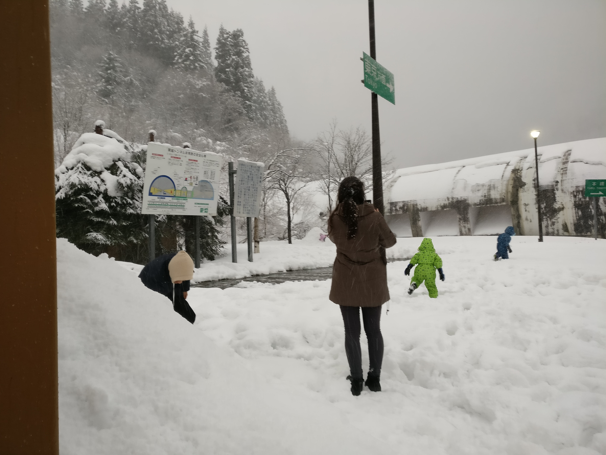

5日1月
More snow on the way back from Yamagata. Maybe it’s just because I’m from Hawaii, but I also saw little sprinkler-like objects on the ground in the parking lot that sprayed out water from the ground all over the parking lot so that it wouldn’t freeze over, which I found interesting.

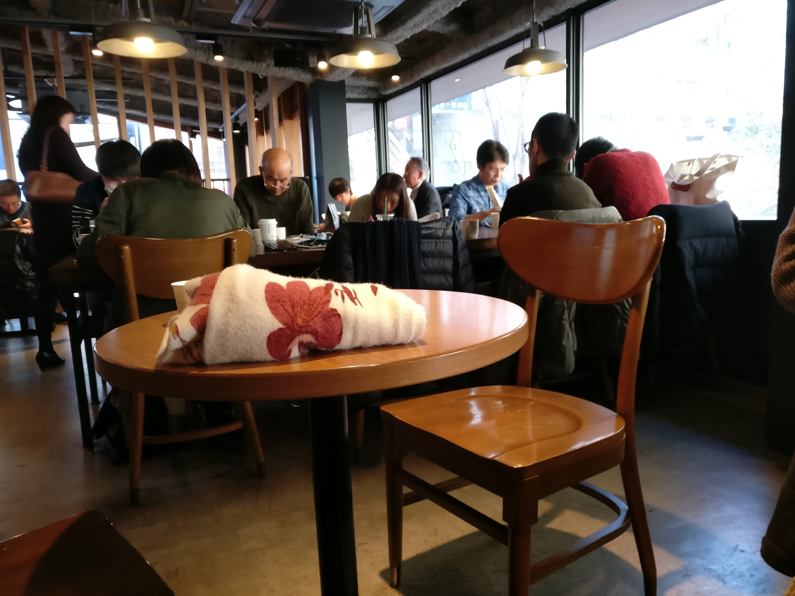

7日1月
As February draws near, the number of studying middle schoolers does as well. Just like American students, Japanese students also spend a lot of time studying in coffee shops like this one. One could probably even make the argument that Japanese students study even more than American ones do, since the high school and college that you attend in Japan makes an enormous impact on which company you can work at, even going so far as to hire tutors (家庭教師 katei kyoushi) to teach them in their own homes! (which unfortunately I don’t have a picture of)

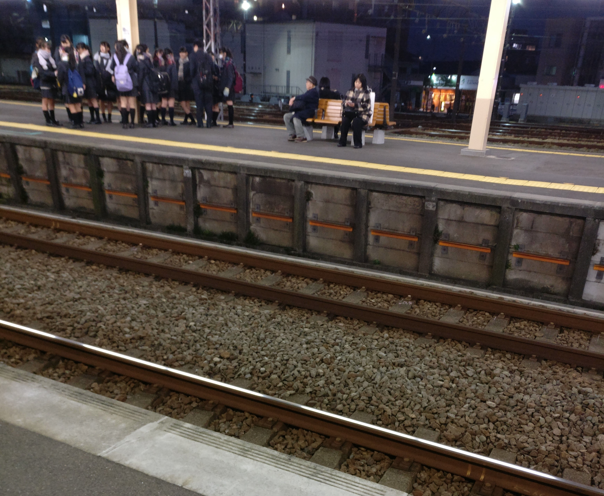

7日1月
A group of students gathering at a station on the last official day of the new year.

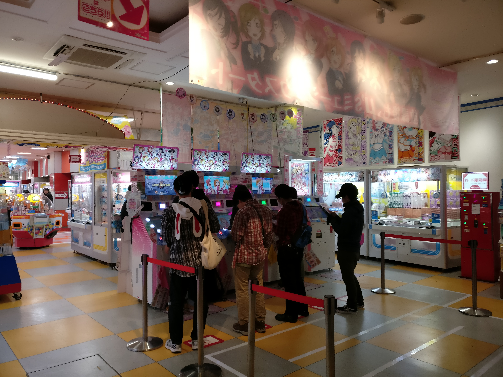

9日1月、２、10日１月、２
Many pictures of people of various age groups in various arcades. In America the arcade has largely died out, but in Japan, arcades are still going very strong (although to be fair, pachinko, the gambling version of arcades, are doing much better). Japanese people of various age groups and of both genders are able to enjoy arcades, which can easily be seen here. 

