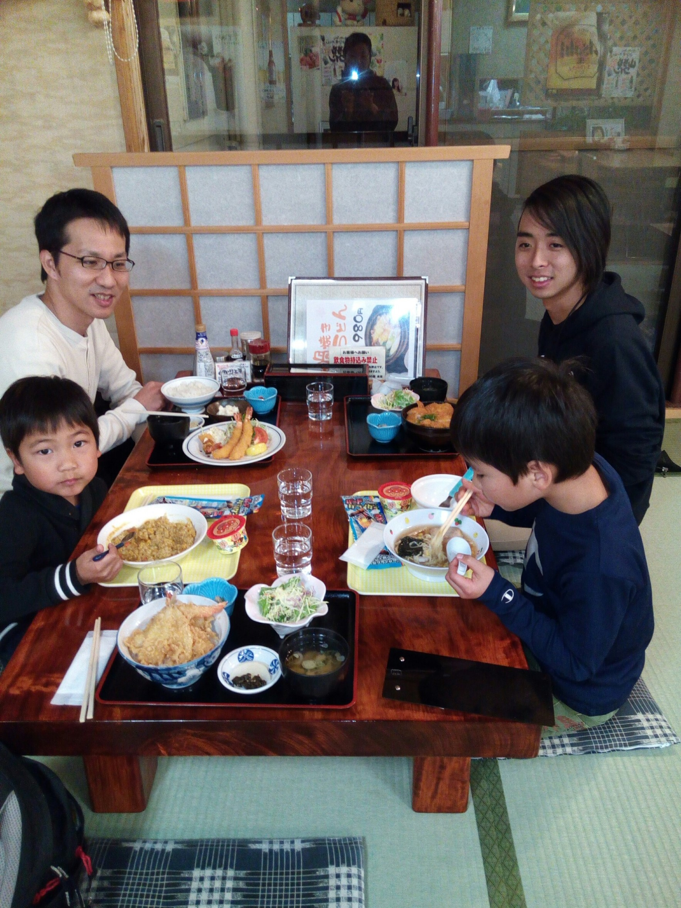

<figure>
  
<figcaption>Eating dinner with my host family on the way to visit their parents in Yamagata.</figcaption>
</figure>

During my stay in Japan, I became immersed in Japanese culture, and had to quickly adapt to the workings of their society. I learned how to ride the train, for example, and how when riding the train one should be quiet and keep their hands above their shoulders in order not to be suspected of groping someone near them when the train is crowded. I also learned to communicate with others, especially those who do not speak English as their first language, a skill that I believe to be valuable in a global setting.

You can find out more about the UH Manoa Study Abroad program [here](http://www.studyabroad.hawaii.edu/programs/semester-year/machida-japan/).
